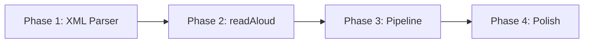

# Implementation Plan: XML から TTS へのローダー

**Branch**: `002-xml-ttl-loader` | **Date**: 2026-02-07 | **Spec**: [spec.md](./spec.md)
**Input**: Feature specification from `/specs/002-xml-ttl-loader/spec.md`

## Summary

XML 形式の書籍データ（`book.xml`）を読み込み、VOICEVOX で音声ファイルを生成する新規スクリプト `xml_pipeline.py` を実装する。既存の TTS 処理コンポーネント（`VoicevoxSynthesizer`, `text_cleaner`, `process_pages`）を再利用し、XML パーサーと Page 変換アダプタを新規実装する。

## Technical Context

**Language/Version**: Python 3.10+
**Primary Dependencies**: xml.etree.ElementTree（標準ライブラリ）, voicevox_core, soundfile, numpy
**Storage**: Files（WAV 出力）
**Testing**: pytest
**Target Platform**: Linux（manylinux）
**Project Type**: Single CLI application
**Performance Goals**: 650KB XML の処理を 1 秒以内に開始
**Constraints**: VOICEVOX Core のセットアップ済みが前提
**Scale/Scope**: 最大 1000 ページ、10MB の XML ファイル

## Constitution Check

*GATE: Must pass before Phase 0 research. Re-check after Phase 1 design.*

constitution.md が存在しないため、デフォルトチェックを適用：

- [x] 新規依存関係は標準ライブラリのみ（`xml.etree.ElementTree`）
- [x] 既存コードの変更は最小限（新規ファイルのみ追加）
- [x] 既存のテストが影響を受けない
- [x] プロジェクト構造に一貫性がある

**Result**: ✅ PASS

## Project Structure

### Documentation (this feature)

```text
specs/002-xml-ttl-loader/
├── spec.md              # 機能仕様
├── plan.md              # 実装計画（本ファイル）
├── research.md          # 技術調査結果
├── data-model.md        # データモデル定義
├── quickstart.md        # クイックスタートガイド
├── checklists/
│   └── requirements.md  # 仕様品質チェックリスト
└── tasks.md             # タスクリスト（/speckit.tasks で生成）
```

### Source Code (repository root)

```text
src/
├── xml_parser.py        # 【新規】XML パーサーモジュール
├── xml_pipeline.py      # 【新規】メインスクリプト
├── text_cleaner.py      # 【既存】Page クラス、clean_page_text()
├── voicevox_client.py   # 【既存】VoicevoxSynthesizer
└── pipeline.py          # 【既存】process_pages()（参照のみ）

tests/
├── test_xml_parser.py   # 【新規】XML パーサーのユニットテスト
└── fixtures/
    └── sample_book.xml  # 【新規】テスト用 XML
```

**Structure Decision**: 既存の `src/` ディレクトリに新規モジュールを追加。`xml_parser.py` で XML 解析ロジックを分離し、`xml_pipeline.py` はエントリポイントとして薄く保つ。

## Implementation Phases

### Phase 1: XML パーサー実装（US1 対応）

**目標**: XML からテキストを抽出し、Page オブジェクトに変換する

**成果物**:
- `src/xml_parser.py`
- `tests/test_xml_parser.py`

**主要タスク**:
1. XmlPage, Figure データクラス定義
2. XML パース関数実装（parse_book_xml）
3. Page 変換関数実装（to_page）
4. ユニットテスト作成

### Phase 2: readAloud 属性対応（US2 対応）

**目標**: `readAloud="false"` 要素をスキップする

**成果物**:
- `xml_parser.py` の拡張

**主要タスク**:
1. readAloud 属性チェックロジック実装
2. 要素スキップテスト作成
3. コメント無視のテスト作成

### Phase 3: パイプライン統合

**目標**: 既存の TTS 処理と統合し、音声ファイルを生成

**成果物**:
- `src/xml_pipeline.py`

**主要タスク**:
1. コマンドライン引数パーサー実装
2. 既存コンポーネントとの統合
3. エラーハンドリング実装
4. 統合テスト作成

### Phase 4: Polish

**目標**: ドキュメント整備と最終確認

**主要タスク**:
1. quickstart.md の検証
2. README 更新（必要に応じて）
3. 全テスト実行と確認

## Dependencies



## Risk Assessment

| リスク | 影響度 | 対策 |
|--------|--------|------|
| XML 構造の想定外の変化 | 中 | sample/book.xml を正として実装 |
| 大規模 XML でのメモリ問題 | 低 | 10MB 上限を文書化、必要なら iterparse 検討 |
| 既存 process_pages() との互換性問題 | 中 | Page クラスの互換性を維持 |

## Next Steps

1. `/speckit.tasks` でタスクリストを生成
2. `/speckit.implement` で実装を開始
