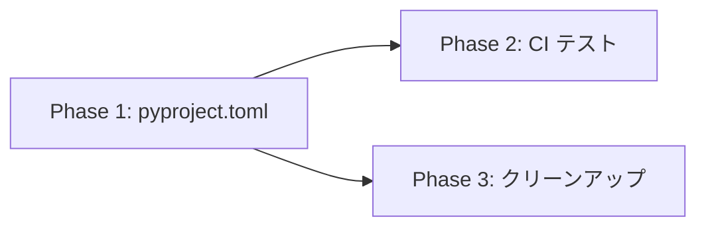

# Implementation Plan: pyproject.toml 整備 + CI テスト追加

**Branch**: `013-pyproject-ci-setup` | **Date**: 2026-02-25 | **Spec**: [spec.md](./spec.md)
**Input**: Feature specification from `/specs/013-pyproject-ci-setup/spec.md`

## Summary

プロジェクト設定の基盤整備。pyproject.toml への依存関係統合、GitHub Actions へのテスト追加、不要ファイルの削除を行う。既存の509件のテストを維持しながら、開発体験を向上させる。

## Technical Context

**Language/Version**: Python 3.10+
**Primary Dependencies**: soundfile, pyyaml, numpy, requests, fugashi, unidic-lite (本番), ruff, pre-commit, pytest, pytest-cov (開発)
**Storage**: N/A
**Testing**: pytest + pytest-cov
**Target Platform**: Linux (ローカル開発)
**Project Type**: Single project (CLI ツール)
**Performance Goals**: N/A (設定変更のみ)
**Constraints**: 既存テスト509件の維持、VOICEVOX wheel の外部インストール対応
**Scale/Scope**: ローカル専用、単一ユーザー

## Constitution Check

*GATE: Must pass before Phase 0 research. Re-check after Phase 1 design.*

Constitution ファイルが存在しないため、スキップ。

## Project Structure

### Documentation (this feature)

```text
specs/013-pyproject-ci-setup/
├── spec.md              # 仕様書 (完了)
├── plan.md              # 本ファイル
├── research.md          # Phase 0 output
├── quickstart.md        # Phase 1 output
└── checklists/
    └── requirements.md  # 品質チェックリスト (完了)
```

### Source Code (repository root)

```text
# 既存構造（変更なし）
src/
├── *.py                 # ソースコード

tests/
├── test_*.py            # テストファイル
├── fixtures/            # テストフィクスチャ

# 変更対象ファイル
pyproject.toml           # 更新: [project] セクション追加
Makefile                 # 更新: setup ターゲット変更
.github/workflows/
└── lint.yml             # 更新: pytest ステップ追加

# 削除対象
requirements.txt         # 削除
requirements-dev.txt     # 削除
src/UNKNOWN.egg-info/    # 削除
```

**Structure Decision**: 既存の Single project 構造を維持。設定ファイルのみ変更。

## Complexity Tracking

該当なし。シンプルな設定変更のみ。

## Implementation Phases

### Phase 1: pyproject.toml 整備 (P1)

| Task | 内容 | 影響ファイル |
|------|------|-------------|
| 1.1 | `[project]` セクション追加 | pyproject.toml |
| 1.2 | dependencies 定義 | pyproject.toml |
| 1.3 | optional-dependencies 定義 | pyproject.toml |
| 1.4 | Makefile setup ターゲット更新 | Makefile |
| 1.5 | 動作確認（pip install -e ".[dev]"） | - |

### Phase 2: CI テスト追加 (P1)

| Task | 内容 | 影響ファイル |
|------|------|-------------|
| 2.1 | pytest ステップ追加 | .github/workflows/lint.yml |
| 2.2 | ワークフロー名変更（lint → ci） | .github/workflows/lint.yml |

### Phase 3: クリーンアップ (P2)

| Task | 内容 | 影響ファイル |
|------|------|-------------|
| 3.1 | requirements.txt 削除 | requirements.txt |
| 3.2 | requirements-dev.txt 削除 | requirements-dev.txt |
| 3.3 | src/UNKNOWN.egg-info/ 削除 | src/UNKNOWN.egg-info/ |
| 3.4 | .gitignore に egg-info 追加確認 | .gitignore |

## Dependencies



Phase 1 が完了しないと、Phase 2/3 は実行不可。
