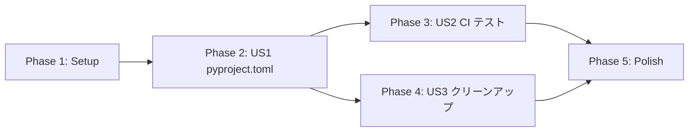

# Tasks: pyproject.toml 整備 + CI テスト追加

**Input**: 設計ドキュメント `/specs/013-pyproject-ci-setup/`
**Prerequisites**: plan.md, spec.md, research.md, quickstart.md

**Tests**: 設定変更フィーチャーのため、TDD は適用外。既存テスト（509件）の維持を確認。

**Language**: Japanese

**Organization**: タスクはユーザーストーリーごとにグループ化。

## Format: `[ID] [P?] [Story] Description`

- **[P]**: 依存関係なし（異なるファイル、実行順序自由）
- **[Story]**: 所属ユーザーストーリー (US1, US2, US3)
- 説明に正確なファイルパスを含める

## User Story Summary

| ID | Title | Priority | FR | 独立テスト基準 |
|----|-------|----------|----|--------------|
| US1 | プロジェクトセットアップの簡素化 | P1 | FR-001,002,003,004,008 | `pip install -e ".[dev]"` → `make test` 成功 |
| US2 | CI でのテスト自動実行 | P1 | FR-005 | PR 作成 → GitHub Actions でテスト実行 |
| US3 | 依存関係の一元管理 | P2 | FR-006,007 | requirements.txt 削除後も動作 |

## Path Conventions

- **Single project**: `src/`, `tests/` at repository root
- 設定ファイル: `pyproject.toml`, `Makefile`, `.github/workflows/lint.yml`

---

## Phase 1: Setup (現状確認) — NO TDD

**Purpose**: 現在の設定ファイルを確認し、変更計画を立てる

- [x] T001 現在の pyproject.toml を確認: pyproject.toml
- [x] T002 [P] 現在の requirements.txt を確認: requirements.txt
- [x] T003 [P] 現在の requirements-dev.txt を確認: requirements-dev.txt
- [x] T004 [P] 現在の Makefile を確認: Makefile
- [x] T005 [P] 現在の CI ワークフローを確認: .github/workflows/lint.yml
- [x] T006 [P] 既存テストが全てパスすることを確認: `make test`
- [x] T007 Edit: specs/013-pyproject-ci-setup/tasks/ph1-output.md

---

## Phase 2: User Story 1 - プロジェクトセットアップの簡素化 (Priority: P1) MVP

**Goal**: pyproject.toml に依存関係を統合し、単一コマンドでセットアップ可能にする

**独立テスト**: `pip install -e ".[dev]"` 実行後、`make test` と `make lint` が成功

### Input

- [x] T008 Read previous phase output: specs/013-pyproject-ci-setup/tasks/ph1-output.md

### Implementation

- [x] T009 [US1] pyproject.toml に [project] セクション追加（name, version, requires-python）: pyproject.toml
- [x] T010 [US1] pyproject.toml に dependencies 追加（soundfile, pyyaml, numpy, requests, fugashi, unidic-lite）: pyproject.toml
- [x] T011 [US1] pyproject.toml に [project.optional-dependencies] dev 追加（ruff, pre-commit, pytest, pytest-cov）: pyproject.toml
- [x] T012 [US1] Makefile の setup ターゲットを `pip install -e ".[dev]"` に更新: Makefile

### Verification

- [x] T013 venv を再作成し `pip install -e ".[dev]"` が成功することを確認
- [x] T014 `make test` が成功することを確認（509件全パス）
- [x] T015 `make lint` が成功することを確認
- [x] T016 Edit: specs/013-pyproject-ci-setup/tasks/ph2-output.md

**Checkpoint**: User Story 1 完了。pyproject.toml でのセットアップが機能。

---

## Phase 3: User Story 2 - CI でのテスト自動実行 (Priority: P1)

**Goal**: GitHub Actions で pytest を自動実行し、PR の品質を担保

**独立テスト**: PR 作成時に GitHub Actions でテストが実行される

### Input

- [x] T017 Read setup analysis: specs/013-pyproject-ci-setup/tasks/ph1-output.md
- [x] T018 Read previous phase output: specs/013-pyproject-ci-setup/tasks/ph2-output.md

### Implementation

- [x] T019 [US2] GitHub Actions workflow に依存関係インストールステップ更新: .github/workflows/lint.yml
- [x] T020 [US2] GitHub Actions workflow に pytest ステップ追加: .github/workflows/lint.yml
- [x] T021 [US2] ワークフローファイル名を ci.yml に変更（オプション）: .github/workflows/

### Verification

- [x] T022 ローカルで `make test` が成功することを確認
- [x] T023 Edit: specs/013-pyproject-ci-setup/tasks/ph3-output.md

**Checkpoint**: User Story 2 完了。CI でテスト自動実行が設定済み。

---

## Phase 4: User Story 3 - 依存関係の一元管理 (Priority: P2)

**Goal**: 不要ファイルを削除し、依存関係を pyproject.toml に一元化

**独立テスト**: requirements.txt 削除後も `pip install -e ".[dev]"` と `make test` が成功

### Input

- [x] T024 Read setup analysis: specs/013-pyproject-ci-setup/tasks/ph1-output.md
- [x] T025 Read previous phase output: specs/013-pyproject-ci-setup/tasks/ph3-output.md

### Implementation

- [x] T026 [P] [US3] requirements.txt を削除
- [x] T027 [P] [US3] requirements-dev.txt を削除
- [x] T028 [P] [US3] src/UNKNOWN.egg-info/ ディレクトリを削除
- [x] T029 [US3] .gitignore に egg-info パターンが含まれていることを確認: .gitignore

### Verification

- [x] T030 venv を再作成し `pip install -e ".[dev]"` が成功することを確認
- [x] T031 `make test` が成功することを確認（509件全パス）
- [x] T032 Edit: specs/013-pyproject-ci-setup/tasks/ph4-output.md

**Checkpoint**: User Story 3 完了。依存関係が pyproject.toml に一元化。

---

## Phase 5: Polish & Cross-Cutting Concerns — NO TDD

**Purpose**: 最終確認とドキュメント整備

### Input

- [ ] T033 Read setup analysis: specs/013-pyproject-ci-setup/tasks/ph1-output.md
- [ ] T034 Read previous phase output: specs/013-pyproject-ci-setup/tasks/ph4-output.md

### Implementation

- [ ] T035 quickstart.md の手順が実際の動作と一致することを確認
- [ ] T036 README.md のセットアップ手順を更新（必要な場合）: README.md

### Verification

- [ ] T037 `make test` で全テストがパスすることを最終確認
- [ ] T038 `make lint` でリントがパスすることを最終確認
- [ ] T039 Edit: specs/013-pyproject-ci-setup/tasks/ph5-output.md

---

## Dependencies & Execution Order

### Phase Dependencies



### Agent Delegation

- **Phase 1 (Setup)**: Main agent 直接実行
- **Phase 2-4 (User Stories)**: speckit:phase-executor（TDD 不要のため）
- **Phase 5 (Polish)**: speckit:phase-executor

### [P] Marker (No Dependencies)

- T002-T006: 異なるファイルの読み取り、並列実行可能
- T026-T028: 異なるファイル/ディレクトリの削除、並列実行可能

---

## Phase Output Artifacts

### Directory Structure

```
specs/013-pyproject-ci-setup/
├── tasks.md                    # 本ファイル
├── tasks/
│   ├── ph1-output.md           # Phase 1 output (Setup 結果)
│   ├── ph2-output.md           # Phase 2 output (US1 完了)
│   ├── ph3-output.md           # Phase 3 output (US2 完了)
│   ├── ph4-output.md           # Phase 4 output (US3 完了)
│   └── ph5-output.md           # Phase 5 output (Polish 完了)
└── red-tests/                  # 未使用（TDD 不要）
```

---

## Implementation Strategy

### MVP First (Phase 1 + Phase 2)

1. Phase 1 完了: 現状確認
2. Phase 2 完了: pyproject.toml 整備
3. **STOP and VALIDATE**: `pip install -e ".[dev]"` → `make test` 成功を確認

### Full Delivery

1. Phase 1 → Phase 2 → Phase 3 → Phase 4 → Phase 5
2. 各フェーズ完了時コミット: `feat(phase-N): description`

---

## Notes

- [P] タスク = 依存関係なし、実行順序自由
- [Story] ラベル = 特定ユーザーストーリーへのマッピング
- 設定変更フィーチャーのため TDD は適用外
- 既存テスト 509 件の維持を各フェーズで確認
- VOICEVOX wheel は Makefile の setup-voicevox で別途処理（pyproject.toml 対象外）
